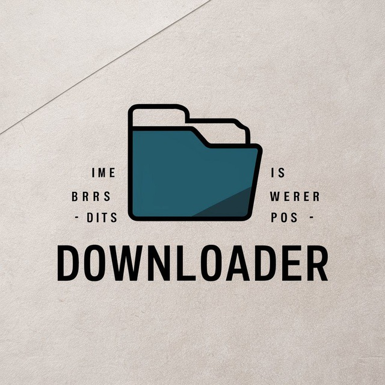

# Downloader

[Downloader](https://github.com/pOsdas/Downloader) fork like a telegram bot

Telegram bot for download your videos



## Content
- [libraries](#libraries)
- [How to run](#how-to-run)
  - [For windows](#Windows)
  - [For Linux](#Linux)
- [Usage](#usage) 
- [License](#license)
- [Author](#author)

## libraries
* asyncio
* yt-dlp
* aiogram
* sqlalchemy
* matplotlib
* pandas

## How to run

1. Copy a repo
2. Create and activate your virtual environment 
    ### Windows:
    ```commandline
    python -m venv venv
    source venv/Scripts/activate
    ```
    ### Linux:
    ```commandline
    python -m venv venv
    source venv/bin/activate

## Usage
1. Install dependencies
```commandline
pip install -r requirements.txt
```
2. Get your own bot token using [botfather](https://t.me/BotFather)
3. Set your own limit for db records in [downloader.py](bot/downloader.py)

4. When downloading videos, you may need a cookie (for example for YouTube). This cookie can be obtained using an extension for your browser
Load information into `cookies.txt`
## License

Distributed under MIT license.\
Additional information in the `LICENSE.txt` file.

## Author
Author: pOsdas
